# 📝 Thinking Out Loud — Full-Stack Blogging Platform

[](https://openjdk.org/)
[](https://spring.io/projects/spring-boot)
[](https://vite.dev/)
[](https://react.dev/)
[](https://www.postgresql.org/)
[](https://www.docker.com/)

**Thinking Out Loud** is a modern, high-performance, and feature-rich full-stack blogging platform. Designed for writers who value thoughtful, long-form content, the platform pairs a robust Spring Boot REST backend with a responsive, modern React frontend. It offers rich-text writing tools, nested commenting threads, secure role-based navigation, and paginated reading experiences.

---

## 🚀 Key Features

*   **Secure Authentication & Identity**: Custom user registration and login backed by stateless **JWT (JSON Web Tokens)** and password hashing using **BCrypt**.
*   **Rich Text Editor (TipTap)**: Admin users can compose articles using a fully customized TipTap editor integration supporting alignments, text highlights, underlines, embedded links, custom layout, and image attachments.
*   **Nested Commenting System**: Support for interactive comment sections under each post. Features include single-level nested replies (preventing deeply nested spaghetti threads), edit/delete permissions, and "Blog Author" badges to easily identify the post creator in the comments.
*   **Paginated Feeds**: Seamless page-by-page rendering of latest posts, reducing bandwidth and improving load times.
*   **Role-Based Access Control**: Standard users (`ROLE_USER`) can read blogs and comment, while only authorized creators (`ROLE_ADMIN`) can access administrative editors to write, update, or delete blog posts.
*   **Docker Containerization**: Production-ready, multi-stage Docker build separating the compilation phase from the execution environment to produce clean, compact runner images.

---

## 🔍 Core Features Deep Dive

### 🪶 Rich Text Formatting & Storage
Writers compose articles on the frontend using a customized **TipTap editor**. Instead of using markdown or plain text, TipTap compiles the formatting blocks into standard, structured **HTML**. 
* **Database Representation**: The generated HTML is sent via the API and stored in a PostgreSQL `TEXT` column (`content` in the `blog` table), preserving paragraph layouts, text alignments, hyperlinks, and underlines directly.
* **XSS Sanitization**: To protect readers from malicious injections, the frontend routes the retrieved HTML through **DOMPurify** before inserting it into the DOM. This ensures all scripting elements, inline styles, or unsafe handlers are scrubbed clean while retaining the rich styling.

### 🖼️ Post Cover Images
Every blog post features a dedicated `imageUrl` string attribute.
* Writers specify a cover image url in the [AdminEditor.jsx](file:///D:/ThinkingOutLoud-blog/ThinkingOutLoud-frontend/thinking-out-loud/src/features/admin/AdminEditor.jsx).
* The feed card renders a cropped card layout preview, and the [BlogDetails.jsx](file:///D:/ThinkingOutLoud-blog/ThinkingOutLoud-frontend/thinking-out-loud/src/features/Blogs/BlogDetails.jsx) view renders the cover image as a full-bleed banner highlighting the article context.

### 💬 Comment Threads & Single-Level Replies
To foster discussion, each post includes a responsive comment thread structure with the following properties:
* **Self-Referential Mapping**: The database `comments` table uses a self-referential parent column (`parent_id`) allowing comment records to link directly to another comment as a reply.
* **Single-Level Constraint**: To prevent nested UI clutter and endless horizontal margins, the system enforces a strict 1-level reply constraint. The backend business logic in [CommentService.java](file:///D:/ThinkingOutLoud-blog/ThinkingOutLoud/src/main/java/com/blog/ThinkingOutLoud/service/CommentService.java#L101-L103) checks if the target comment is already a child reply; if `parent.getParent() != null`, it rejects the request with an `IllegalArgumentException`.
* **Author Identity Badge**: If a user commenting on a blog post is the creator of the post itself, the system marks the comment response object with `isAuthor = true` and flags their username with a highlighted badge.

---

## 🛠️ Tech Stack & Architecture

### Backend Stack
*   **Language & Engine**: Java 21 (Eclipse Temurin)
*   **Framework**: Spring Boot 4.0.2 (Web, Security, JPA, Validation)
*   **Security**: Spring Security + JWT
*   **Database**: PostgreSQL
*   **ORM**: Spring Data JPA & Hibernate
*   **Utilities**: Lombok (boilerplate reduction)

### Frontend Stack
*   **Bundler & Core**: Vite 7.3.1 + React 18/19
*   **Data Fetching**: `@tanstack/react-query` (mutations, query caching, and status tracking)
*   **State Management**: Zustand
*   **Rich Editor**: `@tiptap/react` & `@tiptap/starter-kit`
*   **HTTP Client**: Axios (configured with request and response interceptors to handle automatic JWT headers and token expiration redirects)
*   **Sanitization**: DOMPurify (preventing XSS attacks from parsed editor content)
*   **Routing**: React Router DOM (v7)

---

### 📐 System Flow Diagram

The diagram below outlines the step-by-step request and data flow of the application:

```mermaid
flowchart LR
    %% Style Definitions
    classDef client fill:#e1f5fe,stroke:#03a9f4,stroke-width:2px;
    classDef interceptor fill:#e8f5e9,stroke:#4caf50,stroke-width:2px;
    classDef security fill:#fff9c4,stroke:#fbc02d,stroke-width:2px;
    classDef app fill:#ffe0b2,stroke:#ff9800,stroke-width:2px;
    classDef db fill:#f3e5f5,stroke:#9c27b0,stroke-width:2px;

    subgraph ClientLayer ["1. Frontend Client (React)"]
        UI["React UI Views<br>(BlogList, BlogDetails,<br>AdminEditor, Login/Register)"]:::client
        
        Zustand["Zustand Auth Store<br>(Token, Role, User State)"]:::client
        
        ReactQuery["React Query Cache<br>(Handles pagination & caching)"]:::client
        
        UI <--> Zustand
        UI <--> ReactQuery
    end

    subgraph TransportLayer ["2. HTTP Interceptor Layer"]
        Axios["Axios HTTP Client"]:::interceptor
        Interceptor["Request Interceptor<br>(JWT Expiration Check &<br>Bearer Token Attachment)"]:::interceptor
        
        UI --> Axios
        Axios --> Interceptor
    end

    subgraph SecurityLayer ["3. Backend Security (Spring Security)"]
        Cors["CORS Filter<br>(Checks origins & headers)"]:::security
        
        JwtFilter["JwtAuthenticationFilter<br>(Extracts & validates JWT,<br>sets SecurityContext)"]:::security
        
        Interceptor -->|HTTP Request| Cors
        Cors --> JwtFilter
    end

    subgraph ServiceLayer ["4. Application Controllers & Services"]
        Controllers["REST Controllers<br>(AuthController, BlogController,<br>CommentController)"]:::app
        
        Services["Services (Business Logic)<br>(AuthService, BlogService,<br>CommentService)"]:::app
        
        Repos["JPA Repositories<br>(UserRepository, BlogRepository,<br>CommentRepository)"]:::app
        
        JwtFilter --> Controllers
        Controllers --> Services
        Services --> Repos
    end

    subgraph DatabaseLayer ["5. Database Storage"]
        DB[("PostgreSQL Database<br>(users, blog, comments tables)")]:::db
        Repos <-->|Spring Data JPA / SQL| DB
    end
```




---

## 📂 Project Structure

The project is structured into two main independent directories:

```text
ThinkingOutLoud-blog/
├── ThinkingOutLoud/                    # Backend Spring Boot Application
│   ├── .mvn/                           # Maven wrapper configuration
│   ├── src/
│   │   ├── main/
│   │   │   ├── java/com/blog/ThinkingOutLoud/
│   │   │   │   ├── config/             # CORS, Security filters, and JWT configuration
│   │   │   │   ├── controller/         # Auth, Blog, and Comment API Controllers
│   │   │   │   ├── dto/                # Request / Response DTOs
│   │   │   │   ├── entity/             # JPA Entities (User, Blog, Comment)
│   │   │   │   ├── exception/          # Custom Exceptions & Global REST Handler
│   │   │   │   ├── repository/         # Spring Data JPA Repository interfaces
│   │   │   │   └── service/            # Core business logic (Auth, Blog, Comment, CustomUserDetail)
│   │   │   └── resources/
│   │   │       ├── application.properties      # Shared configurations & default port
│   │   │       ├── application-dev.properties  # Local development (localhost DB defaults)
│   │   │       └── application-prod.properties # Cloud / Render environment variables
│   │   └── test/                       # Backend Integration & Unit Tests
│   ├── Dockerfile                      # Production Multi-stage Docker config
│   ├── pom.xml                         # Maven dependencies & plugins
│   └── mvnw / mvnw.cmd                 # Maven wrapper scripts
│
└── ThinkingOutLoud-frontend/           # Frontend Vite React App
    └── thinking-out-loud/
        ├── public/                     # Public static assets
        ├── src/
        │   ├── api/                    # Axios instances & client services (auth, blog, comments)
        │   ├── app/                    # Routing definition (router.jsx)
        │   ├── components/             # Reusable UI widgets (NavBar, TextEditor components)
        │   ├── features/               # Domain-driven features (Blogs, admin, auth, comments)
        │   │   ├── admin/              # Blog Creation / Edit forms & TipTab components
        │   │   ├── auth/               # Login & Register views, auth state
        │   │   ├── Blogs/              # Blog Lists, Single Blog Detail View
        │   │   └── comments/           # Comment Threads and Reply handlers
        │   ├── store/                  # Zustand state storage
        │   ├── utils/                  # Auth checks & navigation helpers
        │   ├── index.css               # Core styling variables & typographic properties
        │   └── main.jsx                # Application initialization (React Query + DOM Entry)
        ├── .env                        # Local environment credentials & API endpoints
        ├── package.json                # NPM packages & build scripts
        └── vite.config.js              # Vite configuration
```

---

## 🔌 API Documentation

All endpoints are prefixed with `/api`. Here is a reference table showing routes, request permissions, and functions:

### Authentication
| Endpoint | Method | Description | Request Body | Access Level |
| :--- | :--- | :--- | :--- | :--- |
| `/api/auth/register` | `POST` | Register a new account | `{ "username": "...", "password": "...", "role": "ROLE_USER" }` | Public |
| `/api/auth/login` | `POST` | Authenticate and retrieve JWT token | `{ "username": "...", "password": "..." }` | Public |

### Blog Posts
| Endpoint | Method | Description | Request / Query Params | Access Level |
| :--- | :--- | :--- | :--- | :--- |
| `/api/blogs` | `GET` | Retrieve a paginated list of blogs | Query: `page`, `size`, `sort` | Public |
| `/api/blogs/{id}` | `GET` | Retrieve details of a single post | Path variable `{id}` | Public |
| `/api/blogs` | `POST` | Create a new blog post | `{ "title": "...", "content": "...", "imageUrl": "..." }` | Admin Only |
| `/api/blogs/{id}` | `PATCH` | Edit details of a blog post | `{ "title": "?", "content": "?", "imageUrl": "?" }` | Admin Only |
| `/api/blogs/{id}` | `DELETE` | Delete a blog post | Path variable `{id}` | Admin Only |

### Comments
| Endpoint | Method | Description | Request Body | Access Level |
| :--- | :--- | :--- | :--- | :--- |
| `/api/blogs/{blogId}/comments` | `GET` | Get nested comments for a blog post | Path variable `{blogId}` | Public |
| `/api/blogs/{blogId}/comments` | `POST` | Add a comment or write a reply | `{ "content": "...", "parentId": 123 }` (parentId is optional) | Authenticated |
| `/api/blogs/{blogId}/comments/{commentId}` | `PATCH` | Edit comment content | `{ "content": "..." }` | Author Only |
| `/api/blogs/{blogId}/comments/{commentId}` | `DELETE` | Delete a comment | Path variable `{commentId}` | Author or Admin |

---

## ⚙️ Local Development Setup

To run both the backend server and frontend client locally on your machine, follow these instructions.

### Prerequisites
*   **Java**: JDK 21 installed.
*   **Node.js**: Node.js 18+ and `npm` installed.
*   **Database**: PostgreSQL instance running locally.

---

### Step 1: Backend Setup
1.  **Open the backend directory**:
    ```bash
    cd ThinkingOutLoud
    ```
2.  **Create your local Database**:
    Launch PostgreSQL and create a database named `blogdb`:
    ```sql
    CREATE DATABASE blogdb;
    ```
3.  **Configure environment properties**:
    By default, the backend runs in the `dev` profile pointing to database details defined in [application-dev.properties](./ThinkingOutLoud/src/main/resources/application-dev.properties):
    *   URL: `jdbc:postgresql://localhost:5432/blogdb`
    *   Username: `postgres`
    *   Password: `postgres`

    Set your custom JWT secret key and database credentials as environment variables or update the config:
    ```bash
    # Set your JWT signing secret key
    export JWT_SECRET="yourSuperSecretSigningKeyThatIsAtLeast256BitsLong"
    ```
4.  **Run the application**:
    Run using the Maven wrapper:
    ```bash
    # On Linux/macOS
    ./mvnw spring-boot:run
    
    # On Windows
    mvnw.cmd spring-boot:run
    ```
    The backend server will start up on **`http://localhost:8081`** (defined in [application.properties](./ThinkingOutLoud/src/main/resources/application.properties)).

---

### Step 2: Frontend Setup
1.  **Open the frontend directory**:
    ```bash
    cd ../ThinkingOutLoud-frontend/thinking-out-loud
    ```
2.  **Install dependencies**:
    ```bash
    npm install
    ```
3.  **Set environment variables**:
    Confirm the backend endpoint mapping inside the [.env](./ThinkingOutLoud-frontend/thinking-out-loud/.env) file:
    ```env
    VITE_API_BASE_URL=http://localhost:8081/api
    ```
4.  **Run Vite Development server**:
    ```bash
    npm run dev
    ```
    Open your browser and navigate to the printed address (usually **`http://localhost:5173`**).

---

## 🐳 Docker Deployment

The application features a Dockerfile configured for multi-stage building. It ensures compilation is done on the fly, and the final image only contains the compiled JAR and runtime JDK, minimizing image footprint and security attack surface.

### Build the Docker Image
From the `ThinkingOutLoud` (backend) directory:
```bash
docker build -t thinking-out-loud-backend .
```

### Run the Docker Container
You must supply the required configuration parameters via environmental injection:
```bash
docker run -d \
  -p 8080:8080 \
  -e PORT=8080 \
  -e JWT_SECRET="yourSecretSignKey" \
  -e SPRING_PROFILES_ACTIVE=prod \
  -e SPRING_DATASOURCE_URL="jdbc:postgresql://your-cloud-database-host:5432/db_name" \
  -e SPRING_DATASOURCE_USERNAME="your_db_username" \
  -e SPRING_DATASOURCE_PASSWORD="your_db_password" \
  --name blog-api-container \
  thinking-out-loud-backend
```

> [!NOTE]  
> The Docker container exposes port `8080`. By passing `-e PORT=8080` to the container, Spring Boot overrides its internal default port (`8081`) to match the container exposure limit seamlessly.

---

## 📜 Development Tips & Notes

*   **Lombok Issues**: If you see compilation or getter/setter missing errors in your IDE, ensure that **Annotation Processing** is enabled under compiler settings.
*   **Database Migrations**: The project uses `spring.jpa.hibernate.ddl-auto=update` for rapid development schemas. In a production scenario, it is highly recommended to transition to database migration frameworks like **Flyway** or **Liquibase**.
*   **Token Expiry Routing**: The Axios request interceptor checks if the token has expired before dispatching any request. If expired, it flushes the token and redirects the browser window to `/login` immediately.
